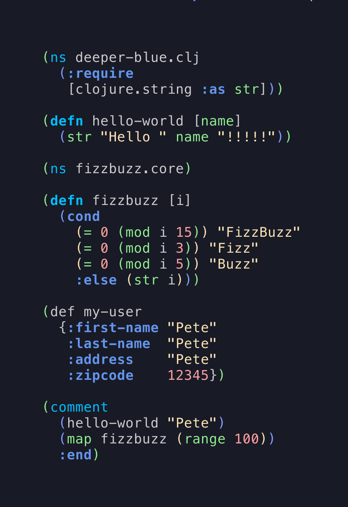

# Deeper Blue Vim Theme

A vim theme heavily inspired by the emacs default deeper-blue theme.

I completely stole the slate theme from vim, and overwrote several of the colors to look like this.



## Installation

With vim-plug

```
Plug fedreg/deeper-blue.vim
```
```
:source %
```
```
colorscheme deeper-blue
```

